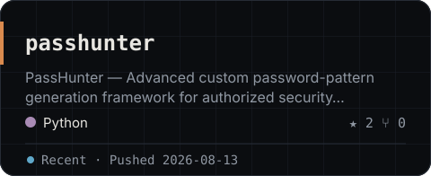
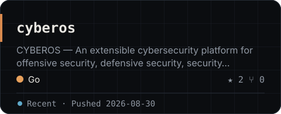
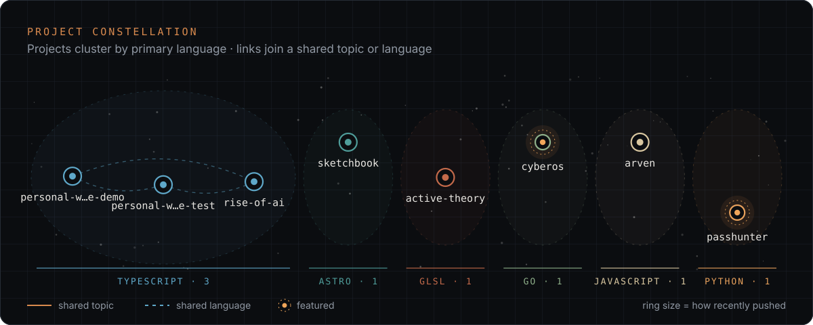
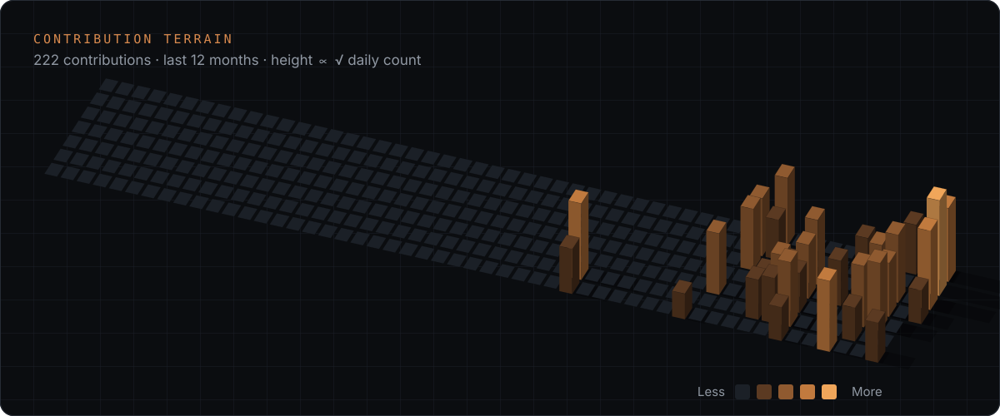
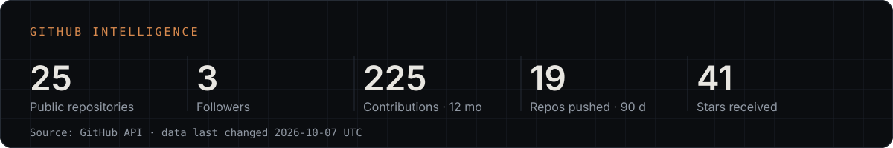
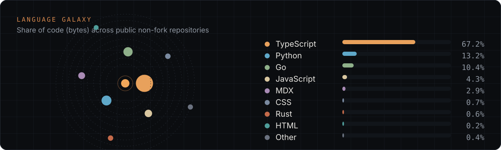
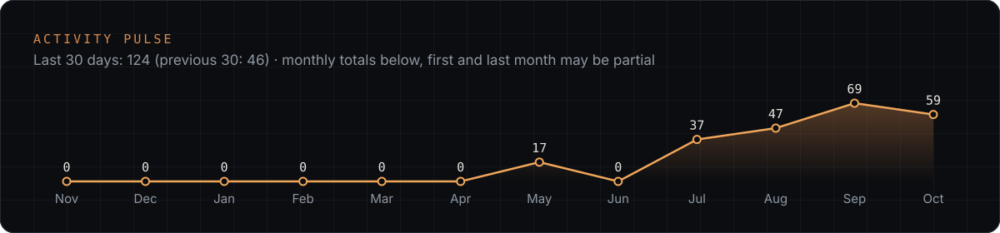

<!-- GENERATED FILE — edit profile.config.yml and run `npm run generate` (see docs/CUSTOMIZATION.md). -->

<picture>
  <source media="(prefers-color-scheme: light)" srcset="assets/generated/hero-light.svg">
  
</picture>

**Md Sourov Mondol** — Cybersecurity · Software Engineering · Research · Bangladesh

Cybersecurity, software engineering and research — building security tooling and learning in public.

[GitHub](https://github.com/itssourov13) · [LinkedIn](https://www.linkedin.com/in/mdsourov-mondol630) · [X](https://x.com/md_sourov630) · [Facebook](https://www.facebook.com/md.sourov.mondol630) · [Instagram](https://www.instagram.com/md.sourov.mondol630)

## Focus

<table>
<tr><td width="40%" valign="top"><ul><li>Application Security</li><li>Web Security</li><li>Vulnerability Research</li><li>Reverse Engineering</li><li>Security Tooling</li><li>Security Automation</li></ul></td><td width="60%" valign="top"></td></tr>
</table>

## Featured work

<table>
<tr><td width="50%" valign="top"></td><td width="50%" valign="top"></td></tr>
</table>

## Latest activity

| Repository | Description | Language | Last push |
| --- | --- | --- | --- |
| [personal-website-test](https://github.com/itssourov13/personal-website-test) | Personal website . Build with Next js. | TypeScript | 2026-10-01 |
| [personal-website-demo](https://github.com/itssourov13/personal-website-demo) | Sourov Mondol — Demo Personal website, portfolio, research, ideas, and engineering. | TypeScript | 2026-09-30 |
| [blog](https://github.com/itssourov13/blog) | Blog Website — Personal publication covering cybersecurity, engineering, programming, technology, ideas, and… | MDX | 2026-09-27 |
| [apk-sherlock](https://github.com/itssourov13/apk-sherlock) | APK Sherlock — an extensible cybersecurity asset analysis platform for automated APK security analysis, risk… | TypeScript | 2026-09-22 |
| [hackergf-ai](https://github.com/itssourov13/hackergf-ai) | Meet Zoya, the next-generation AI assistant powered by Hacker gf Ai . Built to help you code, learn, create,… | JavaScript | 2026-09-22 |
| [onyx](https://github.com/itssourov13/onyx) | Onion Web - A privacy-first research archive for security, privacy, intelligence, and network observability. | TypeScript | 2026-09-22 |

Automatically selected from public repositories by most recent push.

## Contribution terrain

## GitHub intelligence

## Languages & activity

## Digital world

An interactive 3D companion built from the same GitHub data — [open it in your browser](https://itssourov13.github.io/itssourov13/).

---

GitHub data last changed 2026-10-05 UTC · generated by the [profile engine](docs/ARCHITECTURE.md) · [@itssourov13](https://github.com/itssourov13)
