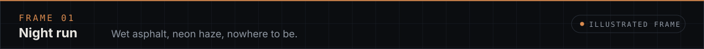

<!-- GENERATED FILE — edit profile.config.yml and run `npm run generate` (see docs/CUSTOMIZATION.md). -->

<picture>
  <source media="(prefers-color-scheme: light)" srcset="assets/generated/hero-light.svg">
  
</picture>

<a href="#focus">Focus</a> &nbsp;·&nbsp; <a href="#featured-work">Work</a> &nbsp;·&nbsp; <a href="#after-hours">After hours</a> &nbsp;·&nbsp; <a href="#github-intelligence">Intelligence</a> &nbsp;·&nbsp; <a href="#recent-work">Recent</a> &nbsp;·&nbsp; <a href="#explore">Explore</a>

Cybersecurity, software engineering and research — building security tooling and learning in public.

## Focus

## Featured work

<table>
<tr><td width="50%" valign="top"></td><td width="50%" valign="top"></td></tr>
</table>

## After hours

 

## GitHub intelligence

## Recent work

| Repository | Description | Language | Status | Last push |
| --- | --- | --- | --- | --- |
| [hackerai-main](https://github.com/itssourov13/hackerai-main) | Official HackerAi - "Production-grade AI-powered cybersecurity assistant with autonomous pentesting… | TypeScript | Active | 2026-10-09 |
| [hackerai](https://github.com/itssourov13/hackerai) | The ultimate AI-powered developer workspace for building, coding, chatting, and deploying smarter. | TypeScript | Active | 2026-10-09 |
| [-Travel-Weather-Planner-Smart-Commute-Decision-System-Python-](https://github.com/itssourov13/-Travel-Weather-Planner-Smart-Commute-Decision-System-Python-) | A simple Python-based smart planner that decides whether commuting is possible based on distance, w… | Python | Active | 2026-10-09 |
| [VercStorm](https://github.com/itssourov13/VercStorm) | — | Python | Active | 2026-10-09 |
| [VercelStrike](https://github.com/itssourov13/VercelStrike) | — | Python | Active | 2026-10-09 |
| [arven](https://github.com/itssourov13/arven) | Cinematic luxury real-estate landing page for a fictional Dubai waterfront residence, powered by GS… | JavaScript | Active | 2026-10-09 |

Selected automatically from public repositories by most recent push. Status: Active ≤ 30 days · Recent ≤ 90 · Quiet ≤ 1 year · Dormant beyond, measured at the last data update.

Archived &amp; excluded (2)

| Repository | Reason | Last push |
| --- | --- | --- |
| [js.org](https://github.com/itssourov13/js.org) | Fork | 2026-08-19 |
| [awesome](https://github.com/itssourov13/awesome) | Fork | 2026-06-30 |

## Explore

<a href="https://itssourov13.github.io/itssourov13/"><b>↗ Open the 3D World</b></a>

<b>Connect</b> &nbsp;·&nbsp; <a href="https://github.com/itssourov13">GitHub</a> &nbsp;·&nbsp; <a href="https://www.linkedin.com/in/mdsourov-mondol630">LinkedIn</a> &nbsp;·&nbsp; <a href="https://x.com/md_sourov630">X</a> &nbsp;·&nbsp; <a href="https://www.facebook.com/md.sourov.mondol630">Facebook</a> &nbsp;·&nbsp; <a href="https://www.instagram.com/md.sourov.mondol630">Instagram</a> &nbsp;·&nbsp; <a href="https://itssourov13.vercel.app/">Website</a>

GitHub data last changed 2026-10-09 UTC · generated by the <a href="docs/ARCHITECTURE.md">profile engine</a> · <a href="https://github.com/itssourov13">@itssourov13</a>

